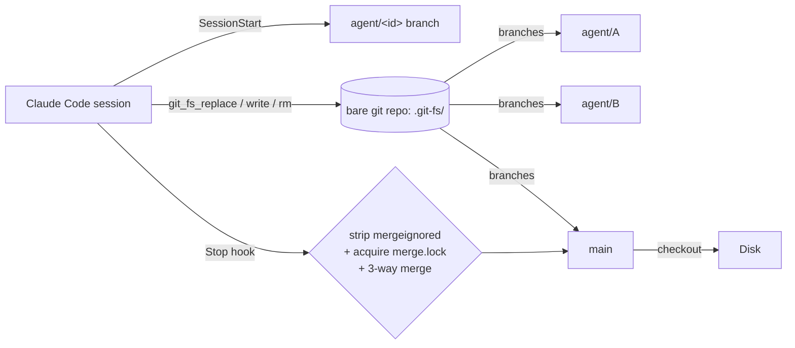

<div align="center">

# git-fs

**A virtual filesystem over a bare git object store — built for AI-agent swarms.**

[](https://github.com/yesitsfebreeze/git-fs/actions/workflows/release.yml)
[](https://github.com/yesitsfebreeze/git-fs/releases/latest)
[](https://github.com/yesitsfebreeze/git-fs/releases)
[](https://github.com/yesitsfebreeze/git-fs/stargazers)
[](LICENSE)
[](https://claude.ai/code)
[](https://modelcontextprotocol.io)

> ⚠️ **Early / experimental.** API may change.

</div>

---

Each agent session works on its own `agent/<session-id>` branch. Every `Read` / `Write` / `Edit` becomes a git commit. When the session ends, the branch is merged into `main` and materialized to disk.

**Why this matters in 2026.** Agent swarms keep colliding on shared filesystems: stale reads, overwritten edits, lost work after a crash. git-fs swaps the filesystem for git's object store so concurrent agents get isolation, atomic commits, and a real audit trail — without bolting on locks or coordination servers.

## Install (Claude Code)

Paste this into Claude Code:

```
Read https://github.com/yesitsfebreeze/git-fs/blob/main/agents/claude/install.md and install git-fs.
```

The agent will detect your platform, download the matching binary from the [latest release](https://github.com/yesitsfebreeze/git-fs/releases/latest), register the MCP server, drop the skill into `~/.claude/skills/git-fs/`, and walk you through the optional hooks.

### Update

```
Read https://github.com/yesitsfebreeze/git-fs/blob/main/agents/claude/update.md and update git-fs.
```

### Build from source

```bash
cargo build --release -p git-fs
# → target/release/git-fs   (CLI + hooks)
# → target/release/git-fs-mcp (MCP server)
```

## How it works



| Stage | What happens |
|-------|--------------|
| SessionStart | Create `agent/<uuid>` from `main`. Seed `.git-fs/session/intent.md`. |
| Tool calls | `git_fs_*` MCP tools write commits to the agent branch. |
| Stop | Strip mergeignored (hard defaults `.agent`, `CONFLICTS.md`) → take merge lock → 3-way merge into `main` → checkout to disk. |

Spec: [`docs/multi-agent-session.md`](docs/multi-agent-session.md).

## Features

- 🌿 **Per-session isolation.** One branch per agent, zero shared mutable state.
- ⚡ **Atomic edits.** Every change is a git commit — no partial writes, no torn reads.
- 🔀 **Concurrent merges.** Exclusive `merge.lock` serializes Stop hooks; sessions in flight see each other's intent via `.git-fs/session/`.
- 🧹 **Mergeignore.** Hard defaults (`.agent`, `CONFLICTS.md`) keep `main` free of session cruft; project-extensible via `.git-fs/mergeignore`.
- 📜 **Full audit trail.** `git log` answers "who changed what, when, in which session."
- 🔌 **MCP-native.** Drop-in for any MCP-aware client; reference skill ships for Claude Code.

## vs. plain git checkouts

| | Plain git worktree per agent | **git-fs** |
|---|---|---|
| Setup per session | clone or worktree add | nothing — auto on SessionStart |
| Disk usage | full copy per session | shared object store |
| Read freshness | depends on `git pull` | always current branch tip |
| Cross-session visibility | none (separate dirs) | sibling intent readable live |
| Merge race | manual coordination | exclusive `merge.lock` |
| LLM-friendly tools | wrap `git` CLI | first-class MCP API |

## Release artifacts

Every tagged release publishes:

| Target | Artifact |
|--------|----------|
| Linux x86_64 | `git-fs-x86_64-unknown-linux-gnu.tar.gz` |
| Linux aarch64 | `git-fs-aarch64-unknown-linux-gnu.tar.gz` |
| macOS Intel | `git-fs-x86_64-apple-darwin.tar.gz` |
| macOS Apple Silicon | `git-fs-aarch64-apple-darwin.tar.gz` |
| Windows x86_64 | `git-fs-x86_64-pc-windows-msvc.zip` |
| Checksums | `SHA256SUMS` |

→ https://github.com/yesitsfebreeze/git-fs/releases/latest

## Roadmap

- [x] Per-session agent branches with auto-merge
- [x] Mergeignore + hard defaults
- [x] Exclusive merge lock
- [x] Claude Code skill + install/update agents
- [x] Release CI (5 targets + SHA256SUMS)
- [ ] Sibling-branch reconcile (path-overlap warnings pre-merge)
- [ ] `Session-Id:` git trailer on every commit
- [ ] Old-branch sweeper (`git-fs prune --merged --older-than 7d`)
- [ ] Cursor / Windsurf / Cline agent guides

## Other agents

Currently only Claude Code is wired up. PRs welcome under `agents/<agent>/install.md` + `update.md`.

## Star history

[](https://star-history.com/#yesitsfebreeze/git-fs&Date)

## Contributing

Issues and PRs: https://github.com/yesitsfebreeze/git-fs/issues. Open a thread before large changes — design notes for new flows go under `docs/`.

## License

MIT — see [`LICENSE`](LICENSE).
