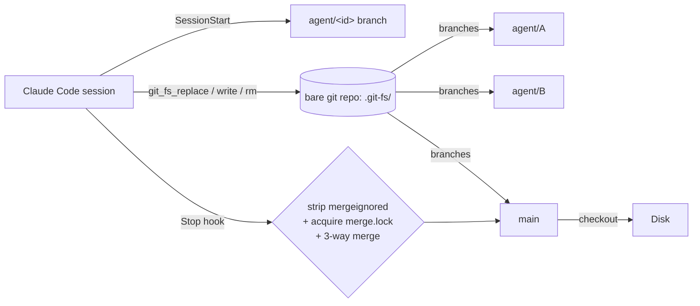

<div align="center">

# git-fs

**A virtual filesystem over a bare git object store — built for AI-agent swarms.**

[](https://github.com/yesitsfebreeze/git-fs/actions/workflows/release.yml)
[](https://github.com/yesitsfebreeze/git-fs/releases/latest)
[](https://github.com/yesitsfebreeze/git-fs/releases)
[](https://github.com/yesitsfebreeze/git-fs/stargazers)
[](LICENSE)
[](https://claude.ai/code)
[](https://modelcontextprotocol.io)

</div>

---

## Why use git-fs

Run **5+ AI agents on the same repo at once** without them stomping each other.

Plain filesystem + multiple agents = stale reads, overwritten edits, lost work on crash. git-fs gives every agent its own git branch in a shared object store. Edits are commits. Sessions end with a 3-way merge into `main`, then materialize to disk. **No locks, no coordination server, no clone-per-agent.**

```
┌─ agent A ──┐
│ edit foo.rs│──┐
└────────────┘  │
┌─ agent B ──┐  ├──► merge.lock ──► 3-way merge ──► main ──► disk
│ edit bar.rs│──┤
└────────────┘  │
┌─ agent C ──┐  │
│ rm baz.rs  │──┘
└────────────┘
```

## What you get

| | Plain FS + N agents | git-fs |
|---|---|---|
| Session startup cost | clone / worktree add (seconds–minutes) | **`git branch` (~ms, 0 file copies)** |
| Disk per extra agent | full working tree (~repo size × N) | **0 bytes — shared object store** |
| Write atomicity | partial writes possible on crash | **every edit = 1 git commit, atomic** |
| Concurrent edits to repo | last-writer-wins, silent loss | **isolated branches, explicit 3-way merge** |
| Crash recovery | unsaved buffers gone | **`git reflog` — every tool call is recoverable** |
| Audit trail | filesystem mtime, no author | **`git log` — who, what, when, which session** |
| Cross-agent visibility | none | **siblings read each other's `.git-fs/session/` live** |
| Merge race protection | none | **`flock` on `merge.lock` — serialized Stop hooks** |
| Tooling for LLMs | shell out to `git` | **first-class MCP: `git_fs_read/write/replace/merge/...`** |

## What it can do

- 🌿 **N agents, 1 repo, 0 collisions** — each session lives on `agent/<uuid>`.
- ⚡ **Edit-as-commit** — `git_fs_replace` / `write` / `rm` each produce one commit. Roll back with `git reset`.
- 🔀 **Auto-merge on Stop** — exclusive `merge.lock` + 3-way merge into `main` + checkout to disk.
- 🧹 **Mergeignore** — junk files (`.agent`, `CONFLICTS.md`, your own globs) never reach `main`.
- 🪟 **Worktree-aware** — per-worktree by default, or share one bare repo across worktrees via `GIT_FS_REPO`.
- 📜 **Full audit** — `git log agent/<id>` answers "what did this agent do?"
- 🔌 **MCP-native** — works with any MCP client; ships as a Claude Code plugin.

## Install (Claude Code plugin)

```
/plugin marketplace add yesitsfebreeze/git-fs
/plugin install git-fs@git-fs
```

That's it. On the next session start the plugin:

1. **Downloads the matching `git-fs` + `git-fs-mcp` binary** for your OS/arch from the [latest release](https://github.com/yesitsfebreeze/git-fs/releases/latest) into the plugin folder. No PATH changes, no system install.
2. **Auto-initializes** any git repo it lands in — creates `.git-fs/` and writes `Edit`/`Write` deny rules into the project's `.claude/settings.json` so all edits go through git-fs MCP tools.
3. **Registers** the `git-fs` MCP server and the `SessionStart` / `Stop` / `PreToolUse(Read)` hooks.
4. **Exposes** the `git-fs` skill so Claude knows the tool-selection rules.

Verify: session banner shows `Branch: agent/<uuid>`, and `git_fs_branch_list` returns the active branches.

Supported platforms: Linux x86_64 / aarch64, macOS Intel / Apple Silicon, Windows x86_64.

### Other MCP-capable agents (Cursor, Windsurf, Cline, …)

Install the binary manually and point the agent at it:

```bash
# Linux / macOS
curl -L https://github.com/yesitsfebreeze/git-fs/releases/latest/download/git-fs-<target>.tar.gz | tar -xz -C ~/.local/bin/
chmod +x ~/.local/bin/git-fs ~/.local/bin/git-fs-mcp
```

```json
// .mcp.json (or your agent's equivalent)
{
  "mcpServers": {
    "git-fs": { "command": "git-fs-mcp" }
  }
}
```

Then `git-fs init-project` inside the target repo to create `.git-fs/`. Non-Claude agents do not get the auto-merge Stop hook — use `git_fs_merge` manually at end of session.

## Update

```
/plugin update git-fs@git-fs
```

The launcher caches binaries in the plugin folder. To force a fresh binary download, delete `bin/` inside the plugin install dir; the next session will re-fetch from the latest release.

### Build from source

```bash
cargo build --release -p git-fs
# → target/release/git-fs    (CLI + hooks)
# → target/release/git-fs-mcp (MCP server)
```

## How it works



| Stage | What happens |
|-------|--------------|
| SessionStart | Create `agent/<uuid>` from `main`. Seed `.git-fs/session/intent.md`. |
| Tool calls | `git_fs_*` MCP tools write commits to the agent branch. |
| Stop | Strip mergeignored (hard defaults `.agent`, `CONFLICTS.md`) → take merge lock → 3-way merge into `main` → checkout to disk. |

Spec: [`docs/multi-agent-session.md`](docs/multi-agent-session.md).

## Cross-agent coordination

Sibling agents commit to their own `agent/<id>` branch, not to `main`. `main` only catches up at Stop. So mid-session, `main` does **not** reflect work other agents have already shipped.

Before editing a file a sibling might also be touching:

1. `git_fs_branch_list` — find active `agent/*` branches.
2. `git_fs_diff ref_a:main ref_b:agent/<sibling>` or `git_fs_read ref:agent/<sibling> path:<file>` — see their version.
3. **Align to the latest version across all agent branches**, not just your own. Otherwise both agents fork from stale state and clobber each other at Stop.
4. If a sibling already implemented a similar pattern, mirror it — less merge surface, more coherent code.

Need a sibling's work visible mid-session? Merge it in explicitly with `git_fs_merge` (or the `/merge` skill).

## Worktrees

**Per-worktree (default).** Each worktree has its own `.git-fs/` at its root. Sessions in worktree A do not see worktree B.

**Shared store across worktrees.** Set `GIT_FS_REPO` env var to one absolute bare repo path. In shared mode, `git_fs_branch_list` returns every agent across every worktree, the merge lock serializes Stop hooks globally, and Stop's final `checkout main → cwd` still writes into the calling session's own worktree — only the git history is shared.

## Release artifacts

Every tagged release publishes:

| Target | Artifact |
|--------|----------|
| Linux x86_64 | `git-fs-x86_64-unknown-linux-gnu.tar.gz` |
| Linux aarch64 | `git-fs-aarch64-unknown-linux-gnu.tar.gz` |
| macOS Intel | `git-fs-x86_64-apple-darwin.tar.gz` |
| macOS Apple Silicon | `git-fs-aarch64-apple-darwin.tar.gz` |
| Windows x86_64 | `git-fs-x86_64-pc-windows-msvc.zip` |
| Checksums | `SHA256SUMS` |

→ https://github.com/yesitsfebreeze/git-fs/releases/latest

## Plugin layout

```
<plugin root>/
├── .claude-plugin/
│   ├── plugin.json          # MCP server registration
│   └── marketplace.json     # marketplace entry
├── hooks/hooks.json         # SessionStart / Stop / PreToolUse(Read)
├── dist/launcher.js         # node: binary download + dispatch
├── skills/git-fs/SKILL.md   # tool-selection rules
├── bin/                     # downloaded binaries (created on first run)
└── git-fs/                  # Rust source (built into releases)
```

## License

MIT — see [`LICENSE`](LICENSE).
